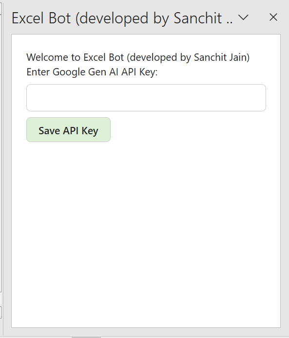

# Excel Bot

Excel Bot empowers users to automate Excel tasks simply by talking to their spreadsheets. With natural language instructions, AI agents generate JavaScript code using the Excel JavaScript API to perform the requested actions.

The generated code can be reviewed, edited, or executed directly to handle tasks like formatting cells, inserting data, or applying formulas. This streamlines repetitive workflows and makes interacting with Excel more intuitive eliminating the need to memorize complex formulas or hunt through menus for the right options.

## Installation

Clone the repository then run following commands.

```bash
# This will download the node modules needed to run this add-in.
$ npm install

# this will build the add-in 
$ npm run build

# This will start the server on your desktop and launch your add-in on Excel.
$ npm run start
```
It might take some time for the add in to load and if its your first time it might return a reload page, simply click the reload button and it should work fine.

## Example

- Start the server


- If a reload screen appears, click the Reload button to continue


- Enter your Google Generative AI API key to enable access to the Gemini model, then click Save. You can create one here - https://aistudio.google.com/u/1/api-keys


- This will open the Excel Bot chat


- Type the instruction


- The AI agent generates code to fulfill the user's instruction.


- Now you can click on the "execute" button to execute this code.


- You can also chose to edit the code and then execute it. To do this first click on "run code" code button. Then send the updated code in the chat and finally execute it.

	- Click on Run Code button  
	  
	
	- Send updated code in chat  
	  
	
	- Execute updated code  
	  
	
	- Changes reflected  
	  


**Note**: If the code generated by the agent results in errors, you can either correct it manually or re-run your instruction. The agent will take the previous error into account and attempt to generate improved code based on that feedback.
